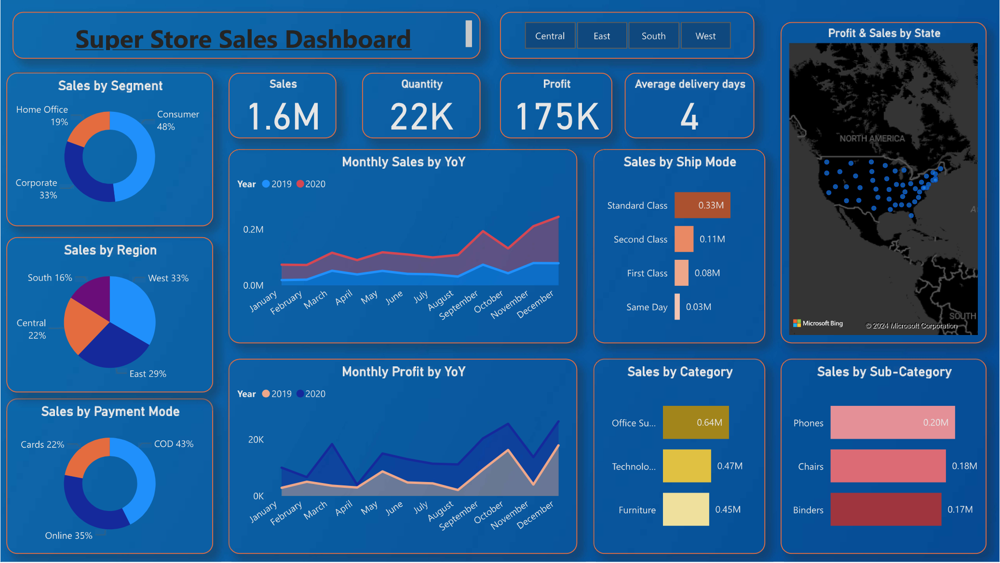
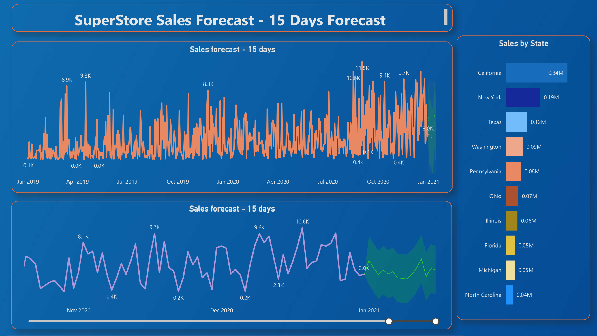

# Super Store Sales Analysis Dashboard (Power BI)

## Objective
To contribute to the success of a business by utilizing data analysis techniques, specifically focusing on time series analysis, to provide valuable insights and accurate sales forecasting.

## Description
This project involves an end-to-end data analysis solution aimed at helping businesses optimize sales strategies using Power BI. The analysis is broken down into the following components:

1. **Dashboard Creation:**
   - Identify key performance indicators (KPIs).
   - Design an intuitive and visually appealing dashboard.
   - Implement interactive visualizations and filtering capabilities to allow users to explore data at various levels of granularity.

2. **Data Analysis:**
   - Provide valuable insights into the effectiveness of sales strategies through visualizations and charts.

3. **Sales Forecasting:**
   - Leverage historical data and apply time series analysis techniques to generate sales forecasts for the next 15 days.

4. **Actionable Insights and Recommendations:**
   - Deliver insights that support strategic decision-making.
   - Help supermarkets achieve growth, efficiency, and customer satisfaction.

## Learning Outcomes
- Developed and optimized interactive dashboards in **Power BI**.
- Applied **data analysis** techniques for extracting meaningful business insights.
- Utilized **time series analysis** for accurate **sales forecasting**.
- Enhanced **data visualization** skills to improve business intelligence and reporting.

## Screenshots
### Super Store Sales Dashboard

### Super Store Sales Forecasting

## Tools & Technologies Used
- **Power BI** (Dashboard Creation & Visualization)
- **Python** (Data Processing & Analysis)
- **SQL** (Data Querying & Manipulation)
- **Time Series Analysis** (Sales Forecasting)

## Future Enhancements
- Integration with additional data sources to improve analytical depth.
- Automation of data pipelines for real-time insights.
- Enhancing forecasting accuracy with **machine learning** models.

---
This project demonstrates strong skills in **data analysis, business intelligence, dashboard creation, and sales forecasting**, making it a great addition to a **data analyst portfolio**. 🚀

